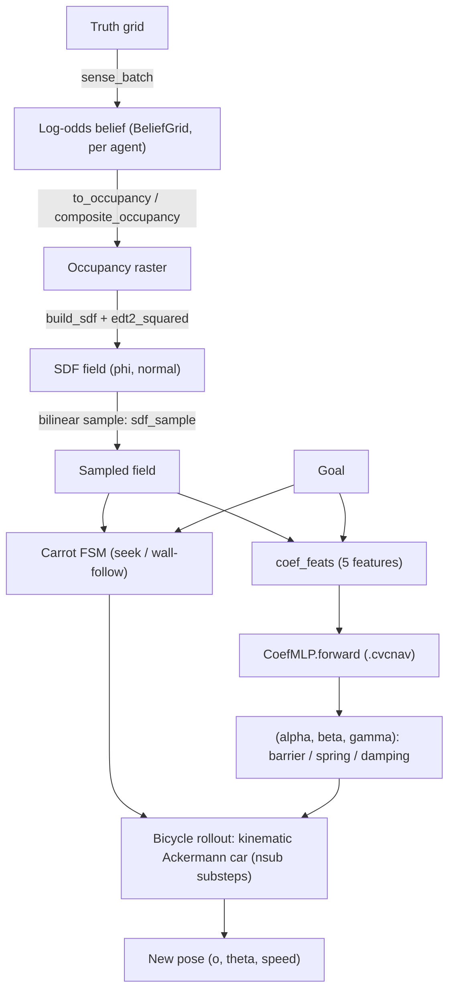

# Using `cvc::nav` — and how it maps to GRL-SNAM

> **Just want the commands to run the demos?** See the one-page
> [cvc-nav-and-grl-snam-quickstart.md](cvc-nav-and-grl-snam-quickstart.md) —
> install cvcpkg, run the published Austin demos, or build them yourself. This
> document is the reference behind it.

A team guide to libcvc's `cvc::nav` module: what it is, how each piece corresponds
to the Python GRL-SNAM code you already know, and how to actually use it from
either side.

**Audience:** anyone who works on GRL-SNAM navigation, or who wants to run that
navigation inside a C++ host. This covers the base geometry-navigation layer, plus
the material-aware extension built on top of it (§9).

> **Reality check — 2026-09-09.** One thing changed since this guide was first written that matters
> for how you read it: **the obstacle barrier force is now the true gradient of its barrier — fully
> landed, not just merged.** Earlier the returned derivative was off by `(d − d̂) + 1`, which put an
> *attraction band* over `(0.39–0.80)·d̂`. Both halves are in: Python (`GRL-SNAM#61`) and C++
> (`libcvc#344`), **republished as libcvc 3.3.0+cvc.5** so every `pycvc` that resolves it gets the
> fix. The coefficient identities below (`α`/`β`/`γ` = barrier/goal-spring/damping) are unchanged;
> what changed is that the barrier term is now conservative — and steeper, which forced a
> `coef_train` learning-rate re-tune (`lr=5e-5`, was `2e-4`). **Every weight trained before this fix
> is stale.**

> This guide remains the base geometry-navigation reference — nothing above touches `cvc::nav`'s own
> module map in §3.

**Contents**

- [1. The one-paragraph mental model](#1-the-one-paragraph-mental-model)
- [2. The single most important thing: the fidelity contract](#2-the-single-most-important-thing-the-fidelity-contract)
    - [A note on the vocabulary: this is not a Hamiltonian system](#a-note-on-the-vocabulary-this-is-not-a-hamiltonian-system)
- [3. The module map (the core of "how it maps")](#3-the-module-map-the-core-of-how-it-maps)
- [4. The pipeline, stage by stage](#4-the-pipeline-stage-by-stage)
    - [What "bicycle rollout" actually models](#what-bicycle-rollout-actually-models)
- [5. Getting it running locally](#5-getting-it-running-locally)
    - [Step 0 — install cvcpkg itself](#step-0-install-cvcpkg-itself)
    - [Tier 1 — install the runnables (no build at all)](#tier-1-install-the-runnables-no-build-at-all)
    - [Activate the prefix — then everything below is unqualified](#activate-the-prefix-then-everything-below-is-unqualified)
    - [Tier 2 — build the native kernels (still via cvcpkg)](#tier-2-build-the-native-kernels-still-via-cvcpkg)
    - [Two canonical builds worth having in your fingers](#two-canonical-builds-worth-having-in-your-fingers)
    - [Verify you actually got it](#verify-you-actually-got-it)
    - [Prove the port is faithful (the parity suite)](#prove-the-port-is-faithful-the-parity-suite)
    - [Run the pure-C++ demos](#run-the-pure-c-demos)
- [6. Using it — Path A: from Python (GRL-SNAM)](#6-using-it-path-a-from-python-grl-snam)
    - [Feature flags](#feature-flags)
    - [Probing what your `pycvc` actually carries](#probing-what-your-pycvc-actually-carries)
    - [Running the whole shared-belief navigation runtime in C++ from Python](#running-the-whole-shared-belief-navigation-runtime-in-c-from-python)
- [7. Using it — Path B: pure C++ (embed the runtime)](#7-using-it-path-b-pure-c-embed-the-runtime)
- [8. The learned policy: `.cvcnav` weights](#8-the-learned-policy-cvcnav-weights)
- [9. Beyond geometry: material-aware navigation](#9-beyond-geometry-material-aware-navigation)
- [10. Gotchas & FAQ](#10-gotchas-faq)
- [11. See also](#11-see-also)

---

**Repos referenced.** Two, cloned side by side into a directory of your choosing
(`pycvc` is built out of `libcvc`, not a separate repo):

```bash
git clone https://github.com/CVC-Lab/GRL-SNAM.git
git clone https://github.com/transfix/libcvc.git
```

Every path below is written repo-relative — `libcvc/inc/cvc/nav/drive.h`,
`GRL-SNAM/grl_snam/nav.py` — so it resolves wherever you put those two clones.
§5 walks through getting the whole thing running from a cold start.

---

## 1. The one-paragraph mental model

GRL-SNAM's navigation math is **canonical in Python** (numpy + PyTorch).
`cvc::nav` is a **torch-free C++ re-implementation of the navigation hot path** —
the distance transform, A*, the SDF field, the sensor/belief update, the learned
coefficient policy, the bicycle drive, and the reactive navigation loop that ties them
together. It exists for two reasons:

1. **Speed from Python.** The kernels are a *bit-identical* drop-in that GRL-SNAM
   calls transparently through `pycvc`. The profiled baseline — 8 agents, real
   Austin, 384² grid, fog on — ran `Squad.step()` at **1375 ms/tick (0.73 Hz)**,
   where 30 Hz needs 33.3 ms, a 41× gap; the ported kernels close most of it
   (EDT 43–65×, A* 58–77×, both bit-identical). See
   `GRL-SNAM/docs/PERFORMANCE.md` — and note those are *that* workload's numbers,
   not a promise at arbitrary agent counts.
2. **No Python at all.** A renderer or game engine can `#include <cvc/nav/…>` and
   run the whole navigation loop — sense, plan, drive — with zero libtorch and zero Python.

Python stays the reference twin and the trainer of record; C++ is a fidelity-graded
port that never silently redefines the reference. **The status: the port is
complete (P0–P8 + CUDA + a torch-free trainer); see
`GRL-SNAM/docs/CVCNAV_CPP_PORT_ROADMAP.md`.**

---

## 2. The single most important thing: the fidelity contract

Not every part of `cvc::nav` is "the same" as Python in the same sense. The port
draws a hard line **at the bilinear SDF sample**. Everything upstream of it is
reproduced to the byte; everything from it onward is reproduced to ~1 ULP. Know
which tier you are standing on before you compare outputs.

| Tier | What it covers | What "equal to Python" means | Can it be a transparent default? |
|---|---|---|---|
| **BIT-identical** | EDT, `build_sdf`, `inflate`, line-of-sight, `nearest_free`, A*, string-pull, `sense_batch`, `to_occupancy`/`composite`/`world_to_cell`, neighbours | `array_equal` **and** `.tobytes()` match numpy | **Yes** — this is why the kernels are on by default |
| **FLOAT-equivalent** (~1e-4 / ~1 ULP) | `sdf_sample`, `coef_mlp.forward`, `bicycle_rollout`, fused `drive_step` | `allclose(rtol=1e-4…1e-6)` vs torch | **No — opt-in forever.** torch is the golden generator |
| **BEHAVIORAL** | whole-drive `sim_world.step` vs `Swarm.step` | same reach-set, no clearance regression, mode-flip rate under budget | No — opt-in |
| **torch-independent** | the trainer (`coef_train`) | finite-difference gradcheck (analytic == numeric) | N/A — it needs no torch reference |

**Why the line matters.** The drive contains a discrete carrot state machine
(`stall > 70`, `moved < 0.15`, `dg < best − 1e-3`). A sub-ULP difference in one
sample can flip one of those thresholds on a *different* tick and send an agent a
different — but equally valid — way. So a single tight position tolerance over a
long horizon is the *wrong* test for the drive; that's why the whole-drive tier is
"behavioral," and why the float-equivalent drive is never wired transparently into
the Python torch path. If you need per-op tightness, compare component-by-component
(sampler, MLP, rollout) in lockstep, not end-to-end trajectories.

### A note on the vocabulary: this is not a Hamiltonian system

GRL-SNAM's own literature describes the navigator in Hamiltonian-flavored terms, and it's worth
being precise about what that does and doesn't buy you in the code this guide covers, so you don't
go looking for a conserved quantity that was never implemented.

The published foundational paper does have a genuine port-Hamiltonian formulation — but for exactly
one of its three modules (the pose/frame module; the sensor and shape modules are plain symplectic,
no port). Neither the `GRL-SNAM` Python nor `cvc::nav`'s C++ carries that structure forward: there is
no `H` defined, evaluated, or differentiated anywhere in either tree; `mass` is a scalar constant used
once, as a divisor; there is no momentum state, no port, and nothing named or shaped like a symplectic
integrator.

**What's actually running, accurately described:** a learned-coefficient artificial potential field
with viscous damping — the `(α, β, γ)` triple this guide documents in §3/§8 — advanced by a
semi-implicit-Euler-*shaped* update, with the shipped kinematic-bicycle/carrot controller (§4) as the
deployment layer on top: pure-pursuit steering plus governors (corner-speed cap, stopping distance,
creep floor, reverse), not a potential-field integrator itself. That's a real, working, measured
system — it's just not a Hamiltonian one in the structural sense the vocabulary implies, and no energy
or passivity argument transfers to it.

Two concrete consequences worth carrying, not just vocabulary:

- **The one place this was a real bug, not just imprecise language:** the obstacle barrier force used
  to not be the gradient of the barrier it names — see the reality-check box at the top of this guide.
  That's fixed and republished now, but it's the load-bearing example of why "not actually Hamiltonian"
  matters operationally and not just semantically: a force field that isn't conservative can't be
  reasoned about the way the vocabulary suggests.
- **A second, smaller divergence, still open:** `cvc::nav`'s `integrate_surrogate_v2`
  (`geom_rollout.cpp`) runs **explicit** Euler where its Python namesake runs **semi-implicit** — a
  genuine cross-language mismatch, though a narrow-blast-radius one (it isn't exported through
  `pycvc_nav.i`, and its only callers are internal to `geom_rollout.cpp`'s multi-start training loss).
  Worth knowing before you touch that path; not yet reconciled.

None of this changes how you should use `cvc::nav` day to day — the fidelity contract above is what
governs comparing outputs, and it holds regardless of what you call the underlying physics.

---

## 3. The module map (the core of "how it maps")

Each `cvc::nav` header, the GRL-SNAM Python it ports, the `pycvc` symbol it's
exposed as, the `nav_native` adapter that calls it, and its fidelity tier.

| `cvc::nav` header | GRL-SNAM reference | `pycvc.*` | `nav_native.*` | Tier |
|---|---|---|---|---|
| `grid_nav.h` — `edt2_squared`, `build_sdf`, `inflate`, `line_of_sight`, `nearest_free`, `astar`, `simplify`, `*_batch`, `sense_batch`, `neighbors_within_radius` | `grl_snam/planner.py`, `GRL-SNAM/sdf_nav.py`, `grl_snam/belief.py` (sense) | `nav_astar`, `nav_build_sdf`, `nav_inflate`, `nav_line_of_sight`, `nav_nearest_free`, `nav_simplify`, `nav_edt2_squared`, `nav_*_batch`, `nav_sense_batch`, `nav_neighbors` | `astar`, `build_sdf`, `inflate`, `line_of_sight`, `nearest_free`, `simplify`, `edt2`, `*_batch`, `sense_batch`, `neighbors` | **BIT** |
| `belief_occupancy.h` — `to_occupancy`, `composite_occupancy`, `world_to_cell` | `grl_snam/belief.py` (`BeliefGrid.to_occupancy`, `composite_occupancy`, `world_to_cell`) | `nav_composite_occupancy` | `to_occupancy`, `composite_occupancy` | **BIT** |
| `coef_mlp.h` — the `coef_mlp` policy class + `.cvcnav` I/O | `GRL-SNAM/sdf_nav.py` `CoefMLP` + `grl_snam/tools/coef_export.py` | `nav_coef_mlp_forward` | `coef_mlp_forward` | **FLOAT** |
| `drive.h` — `field_stack`, `sdf_sample`, `coef_feats`, `bicycle_rollout`, `drive_step`, `carrot_step` (+ CUDA) | `GRL-SNAM/sdf_nav.py` (`SDFField.sample`, `coef_feats`, `bicycle_rollout`); `grl_snam/swarm.py` (`_plan_carrot`); `grl_snam/nav.py` (`SdfNavigator.step`) | `nav_sdf_sample`, `nav_coef_feats`, `nav_bicycle_rollout`, `nav_drive_step`, `nav_drive_step_cuda` | `sdf_sample`, `coef_feats`, `bicycle_rollout`, `drive_step`, `drive_step_cuda` | **FLOAT** |
| `sim_world.h` — the reactive navigation runtime | `grl_snam/swarm.py` `Swarm` | `nav_sim_world_*` | `NativeSimWorld`, `sim_world_from_swarm` | **BEHAVIORAL** |
| `sim_world_cuda.h` — device-resident GPU twin | `grl_snam/swarm.py` (GPU path) | *C++/CUDA only — not bound; Python reaches the GPU via `nav_drive_step_cuda`* | — | float-equiv |
| `sim_thread.h` — off-render-thread worker + lock-free snapshot | `grl_snam/sim_thread.py` | `nav_sim_thread_*` | `NativeSimThread` | concurrent |
| `coef_train.h` — self-supervised trainer (no torch, no labels) | `grl_snam/tools/coef_train.py` | `nav_train_coef_mlp` | `train_coef_mlp` | gradcheck |
| `material.h` — terrain-risk / hard-hazard navigation | `grl_snam/material.py` (normative; a port of `github.com/SetasAditya/material-aware-grl-snam`) | `nav_material_build`, `nav_material_sample`, `nav_witness_gate(_batch)`, `nav_bicycle_rollout_material`, `nav_drive_step_material`, `nav_integrate_surrogate_material` (C++ `sim_world::set_material` is not bound) | `material_build`, `material_sample`, `witness_gate(_batch)`, `drive_step_material`, `integrate_surrogate_material`, `material_enabled` | BIT build/gate, FLOAT rollout |
| `coef_energy_net.h`, `material_train.h`, `geom_rollout.h` | GRL-SNAM material learned-coefficient net + its training/surrogate | `nav_matnet_forward` | `matnet_forward` | mixed |

> **Read the right Python reference for the carrot FSM.** `grl_snam/nav.py`
> (`SdfNavigator`, single-agent, list-pop history) is the readable reference, but
> the C++ `carrot_step`/`sim_world` is ported from `grl_snam/swarm.py._plan_carrot`
> (vectorized, ring-buffer history) — that's the twin the parity tests pin. They
> agree in behavior; they differ in exactly how `moved` is measured.

---

## 4. The pipeline, stage by stage

One tick of the reactive drive, and where each stage lives on both sides. This is
the data flow the whole module is organized around:



| Stage | C++ (`cvc::nav`) | GRL-SNAM |
|---|---|---|
| Sense the world into belief | `grid_nav.h::sense_batch` | `belief.py::BeliefGrid.sense` |
| Belief → planning occupancy | `belief_occupancy.h::to_occupancy` / `composite_occupancy` | `belief.py::BeliefGrid.to_occupancy` |
| Occupancy → signed distance field | `grid_nav.h::build_sdf` (+ `edt2_squared`) | `sdf_nav.py::build_sdf` |
| Sample the field at the agent | `drive.h::sdf_sample` (`field_stack`) | `sdf_nav.py::SDFField.sample` |
| Build policy features | `drive.h::coef_feats` | `sdf_nav.py::coef_feats` |
| Policy → coefficients | `coef_mlp.h::coef_mlp::forward` | `sdf_nav.py::CoefMLP.forward` |
| Place the steering carrot (FSM) | `drive.h::carrot_step` | `swarm.py::_plan_carrot` / `nav.py::_plan_carrot` |
| Integrate one drive tick | `drive.h::bicycle_rollout` (or fused `drive_step`) | `sdf_nav.py::bicycle_rollout` |
| Whole navigation loop | `sim_world.h::sim_world::step` | `swarm.py::Swarm.step` |
| Route spine over waypoints (A* + lookahead) | *(not ported — stays Python)* | `nav.py::SdfNavigator.drive_to_goal`, `squad.py::Squad` |

Note the last row: the multi-waypoint route driver (A* belief spine + lookahead
subgoal + closest-approach bookkeeping) was deliberately **not** ported. It's a
thin orchestration layer above `sim_world` that reuses the already-ported `astar`/
`simplify` kernels; if you need it in C++ today, drive it from Python or compose it
yourself over `sim_world.retarget`.

### What "bicycle rollout" actually models

**It is a car, not a bike.** The *bicycle model* (a.k.a. the single-track model)
is the standard kinematic model of an **Ackermann-steered, car-like vehicle**: the
two front wheels are collapsed into one virtual wheel on the centerline, and the
two rear wheels likewise, because for the purpose of the path only the centerline
matters. The name describes the two-wheel *abstraction*, not the vehicle being
simulated. So if you are thinking "Ackermann car," you are thinking of the right
thing — with two caveats below.

Both implementations integrate the rear-axle-referenced form:

    θ̇ = (v / L)·tan δ        ẋ = v·cos θ        ẏ = v·sin θ

with the vehicle constants living in `veh_params` (C++) / the `bicycle_rollout`
keywords (Python) — identical defaults on both sides:

| symbol | default | meaning |
|---|---|---|
| `L` | `0.035` | wheelbase, in the normalized frame (see §10 on coordinates) |
| `delta_max` | `0.6` rad | steer limit — fixes the minimum turning radius `R_min = L / tan δ_max` |
| `vmax` | `0.9` | forward speed cap |
| `a_max` | `1.5` | longitudinal acceleration limit |
| `a_lat_max` | `1.0` | lateral-acceleration cap — this is what makes it slow for corners |
| `k_steer` | `0.8` | how hard the wall barrier is allowed to bias the steer angle |

Two things it deliberately does **not** do, worth knowing before you compare it
against a vehicle-dynamics model:

- **It does not implement Ackermann steering *geometry*.** Real Ackermann linkage
  steers the inner and outer front wheels to different angles so both roll about a
  common turn centre. Here `δ` is the single virtual centreline angle (the average
  of those two); the left/right differential is exactly what the single-track
  abstraction throws away. The *constraint* an Ackermann car obeys — nonholonomic,
  bounded turning radius, no strafing — is fully modelled; the *linkage* is not.
- **It is kinematic, not dynamic.** No mass, no tire forces, no slip angle: the
  rear-axle form above carries no side-slip β term, and cornering speed is bounded
  by the explicit `a_lat_max` cap rather than emerging from tire saturation.

That is the point, though — a car that cannot strafe is what separates this from
the holonomic point-mass rollout (`sdf_rollout`), where a turning radius has no
meaning. The learned coefficients `(α, β, γ)` act through the actuators rather
than directly on velocity: the wall barrier *steers* the vehicle away instead of
shoving it sideways.

---

## 5. Getting it running locally

Everything here runs on your own machine — no lab account, no shared prefix, no
special hardware (CUDA is optional throughout). Two tiers, and **you should do
tier 1 first**: it is the reference implementation, it needs no C++ toolchain,
and it is what the native path is graded against.

> **Platforms:** Linux (x86-64) is fully supported, and **Windows (x86-64) now
> works** — the Python stack (`pycvc-gl-cp311`, `torch-cp311`, …) and the native
> `cvcgl-examples` demos publish for Windows (`.\nav-env\Scripts\activate`).
> **macOS is coming** — it is blocked on a VTK macOS bundle reaching the catalog.
> The wasm demos run in any browser. For the terse, copy-pasteable command list
> across all of these, see the one-page
> [quickstart](cvc-nav-and-grl-snam-quickstart.md).

Both tiers go through **cvcpkg**, the group's package manager — that is how
everything in this ecosystem is installed and built. Don't hand-roll a venv or
call `cmake` directly; the recipes already encode the dependency closure and the
build flags, and going around them is how you end up with a mismatched toolchain.

### Step 0 — install cvcpkg itself

```bash
curl -fsSL https://cvcpkg.org/install.sh | sh
```
```powershell
irm https://cvcpkg.org/install.ps1 | iex
```

The bootstrap script detects your platform, downloads a prebuilt binary, verifies
its SHA256 and drops it in `$HOME/.local/bin` (override with
`CVCPKG_INSTALL_DIR`). It needs no Python and no compiler. If you would rather
manage it with pip — or you are on a platform the script does not carry a binary
for — `pip install cvcpkg` works too.

```bash
cvcpkg --version        # 2.0.2 at the time of writing
```

If that fails after a fresh install, `$HOME/.local/bin` is probably not on your
`PATH` yet. Full docs: <https://cvcpkg.org/guide>.

### Tier 1 — install the runnables (no build at all)

One command gets you a working environment. The `grl-snam-cp31X` column pulls its
whole closure — the `pycvc` bindings, numpy, torch — into the prefix:

```bash
cvcpkg install grl-snam-cp312 --prefix ./nav-env    # or -cp311 / -cp313
```

### Activate the prefix — then everything below is unqualified

Every cvcpkg prefix ships an **activation script**, the same ergonomics as a
venv. Source it once and your shell is pointed at that prefix:

```bash
. ./nav-env/bin/activate               # also: activate.csh, activate.fish
```
```powershell
.\nav-env\Scripts\Activate.ps1         # Windows (or Scripts\activate.bat for cmd)
```

It prepends the prefix to everything that matters and saves the old values so it
is reversible — run `cvcpkg_deactivate` to put your shell back:

| variable | what it gets |
|---|---|
| `PATH` | `<prefix>/bin` first — so `python`, `grl-snam` and `cvc` resolve to *this* prefix |
| `LD_LIBRARY_PATH` | `<prefix>/lib`, `<prefix>/lib64` **first** |
| `CMAKE_PREFIX_PATH` | the prefix, so `find_package(cvc CONFIG)` resolves |
| `PKG_CONFIG_PATH` | the prefix's `lib/`, `lib64/`, `share/` pkgconfig dirs |
| `CVCPKG_ACTIVE_PREFIX` | the prefix path, for your own scripts to read |

Two things worth calling out. It does **not** set `PYTHONPATH`, and it does not
need to — putting `<prefix>/bin` on `PATH` means `python` *is* the prefix's
interpreter, which finds `grl_snam` and `pycvc` in its own site-packages. And
that `LD_LIBRARY_PATH` ordering is the thing that keeps tier 2 honest: it is the
same "fresh lib dir must come first" rule the native build depends on, applied
for you rather than exported by hand.

With the prefix active, the commands are just the tools:

```bash
grl-snam selftest
python -c "import grl_snam, pycvc; print('ok')"
```

`grl-snam` is the unified CLI and the fastest way to confirm a good install —
`selftest` needs no data or GPU. Other subcommands worth knowing: `build-sdf`,
`train`, `capture`, `fog`, `lab-demo`, `finale`. Add the C++ command-line tool to
the same prefix if you want it:

```bash
cvcpkg install cvc-cli --prefix ./nav-env          # the `cvc` executable
```

That is the full GRL-SNAM reference twin — navigation math, the multi-agent runtime, the trainer —
running in numpy/PyTorch. **None of it needs `pycvc` to carry nav.** With no
native kernels present the adapter reports `AVAILABLE == False` and every call
transparently takes the Python path, so nothing is gated behind a C++ build.

> **Heads-up on the packaged bindings.** Everything in the catalog is still
> **3.2.4**, and `cvc::nav` first ships in **3.3.0** — so a `cvcpkg install`
> today gets you a working GRL-SNAM whose `nav_native.AVAILABLE` is `False`.
> That is not a broken install; it is the pure-Python path, and it is correct.
> For the native kernels, build tier 2.

### Tier 2 — build the native kernels (still via cvcpkg)

`cvc::nav` is merged into libcvc **`master`** (3.3.0). The `pycvc-cp31X` recipe
takes its source from the checkout it sits in (`source.type: vendored`), so
building it out of a master checkout is what produces nav-carrying bindings:

```bash
cd libcvc
cvcpkg install-deps cvcpkg/recipes/pycvc-cp312 --prefix /path/to/nav-env --config release
cvcpkg build pycvc-cp312 --recipes-dir cvcpkg/recipes --no-deps \
  --prefix /path/to/nav-env --config release
```

**Build into the same prefix you activated.** A prefix accumulates components, so
pointing tier 2 at the tier-1 prefix is what puts the nav-carrying bindings where
your activated `python` will find them. Build into a different prefix and the
verify below stays `False` with nothing obviously wrong — that mismatch is the
single most common way this goes sideways.

**How recipes are addressed.** Both subcommands take *either* a path to a recipe
directory *or* a bare recipe name — a bare name resolves against the default
recipe set plus anything you pass with `--recipes-dir`. cvcpkg also auto-overlays
a `./recipes` directory at the working directory, but **libcvc and GRL-SNAM keep
theirs under `cvcpkg/recipes`**, so that auto-overlay never fires for them: pass
`--recipes-dir cvcpkg/recipes` (or give the path) or the name will not resolve.

Two more things that bite:

- **`--config` belongs on both commands.** `install-deps` picks the dependency
  build config and `build` picks yours; mismatch them and you link a release
  binary against debug deps. `--no-deps` on `build` is the default, but the
  project writes it explicitly to make "reuse what install-deps just put here"
  the visible intent.
- **The recipe still says `upstream_version: 3.2.4`** while master is 3.3.0, so
  the bundle you build is labelled with the older version even though it carries
  the nav code. Harmless locally; bump `cvc_revision` before publishing one.

### Two canonical builds worth having in your fingers

Both follow the same shape libcvc's own README and CI use: **`install-deps` to
populate the prefix, then `build … --no-deps` to build this checkout into it.**
Host tools (cmake, ninja) come from your system `PATH` — add
`--include-host-tools` to have cvcpkg supply those too.

**A. libcvc + the `cvc` CLI, from source, into a prefix.** `cvc-cli`'s recipe is
`source.type: vendored` (it builds the checkout it sits in) and depends on
`libcvc` + `boost`. Order matters: pull the CLI's dependency closure first — that
lands a *published* libcvc — then rebuild libcvc from this checkout over it, so
the CLI links against your tree rather than the 3.2.4 bundle:

```bash
cd libcvc
cvcpkg install-deps cvcpkg/recipes/cvc-cli --prefix deps --config release
cvcpkg build libcvc  --recipes-dir cvcpkg/recipes --no-deps --prefix deps --config release
cvcpkg build cvc-cli --recipes-dir cvcpkg/recipes --no-deps --prefix deps --config release
```

If you only want the SDK and not the CLI, the middle line on its own is the whole
build — `install-deps cvcpkg/recipes/libcvc` then `build libcvc`.

**B. Pure-Python GRL-SNAM into a prefix.** It is published, so the one-liner is
just an install — this is what tier 1 above does:

```bash
cvcpkg install grl-snam-cp312 --prefix deps        # or -cp311 / -cp313
```

To go through the recipe instead:

```bash
cd GRL-SNAM
cvcpkg install-deps cvcpkg/recipes/grl-snam-cp312 --prefix deps --config release
cvcpkg build grl-snam-cp312 --recipes-dir cvcpkg/recipes --no-deps --prefix deps
```

Like the libcvc recipes, `grl-snam-cp31X` is `source.type: vendored` — it builds
the checkout it sits in, so `cvcpkg build` picks up your local edits. It is a
noarch pure-Python column, so the artifact is valid on every platform.

> **If your prefix predates GRL-SNAM revision 4**, that was not true: revisions
> 1–3 pinned `python_sdist` to the published `v0.1.0` tarball, so `cvcpkg build`
> re-built *that release* and silently ignored your tree. Check
> `source.type` in `cvcpkg/recipes/grl-snam-cp31X/recipe.yaml` if a build
> mysteriously does not reflect an edit. Either way, for rapid iteration
> `pip install -e .` under the activated prefix is the shorter loop.

### Verify you actually got it

With the prefix activated, a bare `python` is already the right one:

```bash
python -c "from grl_snam import nav_native; print(nav_native.AVAILABLE, nav_native.enabled())"
```

`True True` means the bit-identical kernels are live. `False` means you are on
the Python path — expected after tier 1, and the sign that a tier-2 build did not
land in the prefix you activated. (If you skipped activation, this is the
first place it shows up: a system `python` will not see the prefix at all.) If a specific `HAS_*` probe is `False`
after a build that otherwise worked, the SWIG wrapper did not regenerate: `touch
bindings/pycvc/pycvc_nav.i`, rebuild, and confirm with
`hasattr(pycvc, "nav_train_coef_mlp")`.

### Prove the port is faithful (the parity suite)

This is the part worth running yourself — it is what makes the fidelity contract
in §2 checkable rather than a claim:

```bash
cd GRL-SNAM
pytest tests/ -k parity -q
```

These compare the C++ kernels against the numpy/torch reference on randomized
inputs, tier by tier — `test_nav_cpp_parity.py` (BIT), `test_sdf_sample_parity.py`
and `test_coef_mlp_parity.py` (FLOAT), `test_sim_world_parity.py` (BEHAVIORAL).
The goldens are generated by forcing the Python backend, so the suite is
self-contained.

**Every parity test skips itself when `pycvc` has no nav** — so a green run on a
tier-1-only machine means "not exercised," not "verified." Check that the tests
actually ran (`pytest tests/ -k parity -v`) before concluding anything.

The C++ side has its own tests, which need neither Python nor `pycvc` — ten
`nav_*_test` targets that `cvcpkg build` has already produced in its build tree:

```bash
cd libcvc && ctest --test-dir build -R nav --output-on-failure
```

### Run the native demos

The visual cvc::nav demos — the reactive swarm on a city, the fog-of-war "ghost"
story, the pursuit finale — are the **`cvcgl-examples`** package, published
**prebuilt**. They are interactive, windowed programs; they need no Python and no
build:

```bash
cvcpkg install cvcgl-examples --prefix ./demos
./demos/bin/nav_city_swarm      # also nav_fog_ghost, nav_finale, nav_city_drive
```

Every demo runs with zero args on a synthetic city; point the swarm/drive ones at
the real Austin scene with `CVC_NAV_BUNDLE` + `CVC_NAV_WEIGHTS` (or `--bundle`).
To build them yourself: `cvcpkg build cvcgl-examples`, or a direct CMake build of
`src/cvcGL` with `-DCVC_BUILD_EXAMPLES=ON` against
`cvcpkg install-deps cvcpkg/recipes/cvcgl-examples` (libcvc + VTK + boost + imgui
— no Python). The one-page [quickstart](cvc-nav-and-grl-snam-quickstart.md) has
the exact flags, and the wasm builds of these demos are live at
<https://transfix.github.io/libcvc/>.

Separately, `libcvc/examples/nav_swarm_demo.cpp` is a minimal **headless code
template** — no window; it prints pose stats — showing the bare `sim_world`
compute loop to copy into your own renderer. It sits behind an off-by-default
option:

```bash
cd libcvc
cvcpkg install-deps cvcpkg/recipes/libcvc --prefix /path/to/nav-env --config release
# with the prefix activated, CMAKE_PREFIX_PATH already points at it
cmake -B build -DCVC_BUILD_NAV_EXAMPLE=ON
cmake --build build -j --target nav_swarm_demo
./build/nav_swarm_demo        # also: nav_material_demo, nav_train_demo
```

`nav_swarm_demo` drives out of the box with no weights file — see §8 on the
shipped biased seed.

---

## 6. Using it — Path A: from Python (GRL-SNAM)

You rarely call `cvc::nav` directly from Python; you toggle it and let GRL-SNAM
dispatch. The adapter is `grl_snam/nav_native.py`.

### Feature flags

| Flag | Default | Effect |
|---|---|---|
| `GRL_SNAM_NAV_BACKEND` | `native` | The **bit-identical kernels**. `python` forces the pure-numpy reference (the parity tests use this to get the golden). |
| `GRL_SNAM_NAV_DRIVE` | `torch` | The **float-equivalent drive** inside `Swarm`. Set `native` to drive one tick through the C++ sample→MLP→bicycle path. |
| `GRL_SNAM_TRAIN_BACKEND` | `torch` | The **trainer**. `native` trains the CoefMLP with the torch-free differentiable rollout. `coef_train` also takes `--backend native`, which overrides the env var. |

Because the kernels are bit-identical, `native` is the safe default; the drive and
trainer are float-equivalent / torch-independent, so they stay explicit opt-ins.

### Probing what your `pycvc` actually carries

```python
from grl_snam import nav_native

nav_native.AVAILABLE        # pycvc importable AND carries nav_astar
nav_native.enabled()        # AVAILABLE and GRL_SNAM_NAV_BACKEND != "python"

# geometry-navigation layer
nav_native.HAS_SENSE_BATCH  # nav_sense_batch
nav_native.HAS_OCCUPANCY    # nav_composite_occupancy
nav_native.HAS_SDF_SAMPLE   # nav_sdf_sample
nav_native.HAS_COEF_MLP     # nav_coef_mlp_forward
nav_native.HAS_DRIVE        # nav_bicycle_rollout / nav_drive_step
nav_native.HAS_SIM_WORLD    # nav_sim_world_*
nav_native.HAS_SIM_THREAD   # nav_sim_thread_*
nav_native.HAS_CUDA_DRIVE   # nav_drive_step_cuda (pycvc built with CUDA)
nav_native.HAS_TRAIN        # nav_train_coef_mlp

# material-aware layer (§9) — probe these separately; a pycvc can carry the
# geometry kernels and still lack the material ones
nav_native.HAS_MATERIAL                     # nav_material_build / _sample / witness gate
nav_native.HAS_MATERIAL_ROLLOUT             # nav_bicycle_rollout_material
nav_native.HAS_MATERIAL_DRIVE               # nav_drive_step_material
nav_native.HAS_MATERIAL_ROLLOUT_INTEGRATOR  # nav_integrate_surrogate_material
nav_native.HAS_SIM_WORLD_MATERIAL           # sim_world with material set
nav_native.HAS_MATNET                       # the learned material-coefficient net
```

That is the complete set — `dir(nav_native)` filtered on `HAS_` is the
authoritative list if it grows.

Every adapter returns the **same Python type** as the function it replaces (a bool
ndarray, an `(r, c)` tuple or `None`, a list of `(r, c)`), so a caller dispatches
with a one-line early return and nothing downstream can tell which path ran. If
`pycvc` is missing or too old, every `HAS_*` is `False`, `enabled()` is `False`,
and the Python/torch path runs — importing `grl_snam` is always safe.

### Running the whole shared-belief navigation runtime in C++ from Python

```python
from grl_snam import nav_native

# Build a native runtime that mirrors a torch Swarm's init (poses, goals,
# colors, field prior, sensor/vehicle params, and the .cvcnav policy):
world  = nav_native.sim_world_from_swarm(sw, "coef_mlp.cvcnav", truth=truth_grid)
thread = nav_native.NativeSimThread(world, hz=60.0)   # off-thread, GIL-free
thread.start()
frame = thread.read()      # (pos_world, heading, speed, mode, reached, tick) or None
thread.retarget(i, gx_n, gy_n)
```

---

## 7. Using it — Path B: pure C++ (embed the runtime)

This is the headline capability: thousands of vehicles reacting to a live map with
no Python. The whole surface is under `libcvc/inc/cvc/nav/`.

```cpp
#include <cvc/nav/sim_world.h>
using namespace cvc::nav;

sim_world::config cfg;              // rows/cols, world bounds, scale, veh params, sensor…
// Zero-setup policy: the shipped biased seed drives out of the box.
// For learned behavior: coef_mlp::load(coef_mlp::default_weights_path())
sim_world world = sim_world::from_occupancy(
    cfg, scene_occupancy, coef_mlp::default_biased(), /*n_agents=*/512);

// Per frame:
world.step();                       // sense (gated) → rebuild → carrot FSM → drive → park
world.snapshot(pos_world, heading, speed, mode, reached);   // WORLD metres
```

Off the render thread, lock-free:

```cpp
#include <cvc/nav/sim_thread.h>
sim_thread sim(world, /*hz=*/60.0);
sim.start();
auto frame = sim.read();            // whole previous frame or whole next — never torn
sim.retarget(i, gx_n, gy_n);        // live edits flow in through a command queue
```

A compilable template lives at `libcvc/examples/nav_swarm_demo.cpp`, built with
`-DCVC_BUILD_NAV_EXAMPLE=ON` (alongside `nav_material_demo.cpp` and
`nav_train_demo.cpp`).

**Belief modes** (the C++ counterpart of `Swarm.belief_mode`), selected by a
per-agent `map_id`:

- `shared` (M = 1) — one belief plane; the thousands-of-agents deployment path.
- `clustered` (K groups) — one plane per group; isolation is structural.
- `private_belief` (M = N) — one plane per agent; the fog-of-war fidelity twin.
  (Spelled `private_belief`, not `private` — the latter is a C++ keyword.)

**Zero-setup ergonomics** worth knowing: `coef_mlp::default_biased()` (drive with no
weights file — the constant `(α,β,γ) = (1,3,4)` basin), `sim_world::from_occupancy`
(scatter N agents on free cells of any rasterized map), and
`coef_mlp::default_weights_path()` (resolve the installed policy).

---

## 8. The learned policy: `.cvcnav` weights

The CoefMLP is a tiny `5 → 64 → 64 → 3` SiLU net whose output is
`softplus(net(feat) + log(expm1(bias)))` — the `(α, β, γ)` = barrier / goal-spring /
damping the rollout uses. One versioned binary blob feeds torch, the C++ CPU
forward, and the CUDA forward alike.

- **Export** a trained torch checkpoint with `grl_snam/tools/coef_export.py`
  (`python -m grl_snam.tools.coef_export coef_sdf.pt coef_mlp.cvcnav`).
- **Default location** the C++ resolves, in order: `CVC_NAV_WEIGHTS` env var → the
  baked `$PREFIX/share/cvc/nav/coef_mlp.cvcnav` → a path relative to the loaded
  `libcvc` (for relocated / cvcpkg installs). That last fallback is `dladdr`-based
  and compiled out on Windows (`#ifndef _WIN32`), so a relocated Windows install
  resolves only the first two — set `CVC_NAV_WEIGHTS` there if the baked path moved.
- **`arch_hash`** in the header pins the architecture: a hidden-size change bumps
  the file and the loader refuses a mismatched net rather than reading garbage.

> **Heads-up — the biased seed is currently the best base policy we have.** The
> *installed default* weights are the **untrained biased seed** (~57–61% reach);
> zero-config driving works, but it is the hand-tuned `(1,3,4)` basin, not a trained
> checkpoint. Do **not** assume training beats it: in current measurements, training
> the base CoefMLP with the self-supervised rollout *regresses* — reach holds near
> the seed to ~25 steps, then falls to ~0.15–0.23 by 100 steps on **both** the torch
> `reach_rate` and the native `sim_world` eval paths, so the older "~65% target"
> does **not** reproduce for the base net. Root cause: the trainer optimizes
> random free-space surrogate rollouts, not the deployed carrot/route-guided regime.
> The lever for better demo nav is the **global field/route**, not the CoefMLP
> weights. Concretely: a **clearance-weighted A\* surcharge** — `sdf_nav.clearance_cost`
> (a hinge `gamma*max(0, d_safe − clearance)` off the SDF clearance field) wired onto
> each agent's `route_cost_fn` via `squad.attach_clearance_routing` — makes the route
> trade a little length for obstacle standoff, which the local drive follows more
> reliably. Measured on the route-guided city squad (which `reach_rate` can't see — it
> drives a route-less `Swarm`, n=20 × 5 seeds): reach **~0.80 → ~0.90** at
> `(d_safe=6, gamma=1.5)`. It is **budget-sensitive** — the standoff route is longer,
> so give the run tick headroom or the longer routes get cut off and reach *regresses*.
> Keep the seed installed unless a trained checkpoint actually beats
> it on your own reach eval (mean up **and** no per-seed regression). See
> `libcvc/docs/NAV_TRAINING.md`.

### Pretrained weights package: `grl-snam-weights`

So you don't have to run a training pass to get *a* trained `(α, β, γ)` net, a
trained base CoefMLP ships as a **public** cvcpkg data package on the **`cvc`**
org (no token — this is the research tier):

```bash
cvcpkg install grl-snam-weights --prefix ./nav-env
# installs, under the prefix:
#   share/grl-snam-weights/coef_sdf.cvcnav   # native CVNV blob — cvc::nav forward
#   share/grl-snam-weights/coef_sdf.pt       # torch checkpoint — grl_snam / sdf_nav
#   share/grl-snam-weights/PROVENANCE.md
```

- **C++ (`cvc::nav`)** — `default_weights_path()` (§8) now also probes
  `share/grl-snam-weights/coef_sdf.cvcnav` as a **last resort**, so an installed
  package is discovered *if the canonical seed is absent*. But the shipped seed
  (`share/cvc/nav/coef_mlp.cvcnav`) is always present and **wins by default** — and
  currently out-performs this trained base net — so to actively use the packaged
  weights set `CVC_NAV_WEIGHTS=…/share/grl-snam-weights/coef_sdf.cvcnav` (checked
  first), or copy it over the baked `coef_mlp.cvcnav`.
- **Python (GRL-SNAM)** — `sdf_nav.CoefMLP().load_state_dict(torch.load(
  "…/coef_sdf.pt")["model_state_dict"])`.

> **What this is (and is not).** `v1.0.0` is a *proof-of-pipeline* checkpoint — a
> short self-supervised run on the `austin_south` SDF that demonstrates the
> train → export → package → pull → load path end to end. It is **not** claimed to
> beat the installed biased seed: per the heads-up above, training the base CoefMLP
> on the free-space rollout surrogate currently *regresses* versus the hand-tuned
> `(1,3,4)` basin. Use this package to exercise the pipeline and as a starting
> checkpoint; keep the seed unless a longer run beats it on your own reach eval.
> The **RF-comm-aware** DBG policy is a *separate, private* package
> (`cvc-dbg-weights` on the `utdbg` org) — the research/development seam is kept at
> the org boundary, never mixed into this public package.

---

## 9. Beyond geometry: material-aware navigation

`cvc::nav` can navigate over *terrain semantics*, not just walls: a per-cell
**risk** field (mud, rubble — soft costs that bias but never block) and a **hard
hazard** mask (water, cliffs — lethal but not physical geometry), adding two force
terms and a feasibility "witness gate" on top of the SDF drive. It's off by default
(byte-unchanged runs) and turned on per-world with `sim_world::set_material(...)`.
Header `libcvc/inc/cvc/nav/material.h`; full write-up in `libcvc/docs/NAV_MATERIAL.md`.
Python normative reference: `grl_snam/material.py`.

Where the geometry drive reads its `(α, β, γ)` from the small `CoefMLP` (§8), the
material drive's soft/hard weights come from a **learned material-coefficient net**,
`CoefEnergyNetMaterial` — a transformer over obstacle/goal tokens plus a CNN
risk-patch encoder (`coef_energy_net.h`, weights in the `.cvcnm` format, GRL-SNAM
reference `grl_snam`'s matnet). It has the full port treatment: a torch-free CPU
`forward_batch`/`backward_one` (finite-difference gradchecked), and a **CUDA twin**
— `forward_batch_cuda` / `backward_batch_cuda` (float-equivalent to the CPU, one
block per agent) plus `material_adam_cuda`, a device-resident optimizer — so the
whole material training step can run on the GPU. Probe `nav_native.HAS_MATNET`; the
device path is `CVC_ENABLE_CUDA`-gated and auto-skips without a device.

---

## 10. Gotchas & FAQ

- **The published `pycvc` does not carry nav yet.** Everything on the package index
  is still `3.2.4`; `cvc::nav` lands in `3.3.0`. So a packaged install reports
  `nav_native.AVAILABLE == False` and runs the Python path — correct behavior, not
  a broken install. Build tier 2 in §5 for the native kernels.
- **Most "it didn't work" reports are an un-activated shell.** `cvcpkg install`
  puts everything in the prefix and changes nothing about your current shell, so
  until you source `<prefix>/bin/activate` (or `Scripts\Activate.ps1`) you are
  still running the system `python` and the system libraries. Check
  `$CVCPKG_ACTIVE_PREFIX` before debugging anything else.
- **A green parity run may mean "skipped."** Every parity test skips itself when
  `pycvc` has no nav, so the suite passes on a tier-1-only machine without
  exercising a single C++ kernel. Run it with `-v` and confirm the tests actually
  ran before treating a pass as verification.
- **`reach_tol` is in normalized units (0.8), not metres.** Both `Swarm` and
  `SdfNavigator` default `0.8`. Do not "fix" it to `0.15`; that changes the
  reach/park set on every run.
- **`nsub` (bicycle substeps) defaults to 1 at deployment.** Raise it only where
  thin-wall tunnelling matters; at the sense-bound steady state its effect is
  second-order.
- **Don't expect the drive to match torch trajectory-for-trajectory.** It's
  float-equivalent per op; over a long horizon the carrot FSM's threshold decisions
  make trajectories diverge while both stay valid. Compare component-wise or on the
  behavioral gate (see §2).
- **Coordinate regime.** The drive works in a **normalized, centered** frame:
  `world = normalized / scale + center`. `sim_world` snapshots convert back to
  world metres for you; the raw sampler/drive functions take normalized positions.
- **The C++ path never becomes the Python default.** `GRL_SNAM_NAV_DRIVE`/
  `GRL_SNAM_TRAIN_BACKEND` are opt-in by design — torch stays the reference and
  golden generator. Only the bit-identical kernels are on by default.

---

## 11. See also

- `GRL-SNAM/docs/NATIVE_CVC_NAV.md` — the GRL-SNAM-side reference (flags, `HAS_*`,
  getting a `pycvc` that carries the layer).
- `GRL-SNAM/docs/CVCNAV_CPP_PORT_ROADMAP.md` — the C++ port design record (phases
  P0–P8, the fidelity boundary, `.cvcnav` format, `sim_world`/`sim_thread`).
- `GRL-SNAM/docs/PERFORMANCE.md` — measured kernel speedups and the scaling wall.
- `libcvc/docs/NAV_TRAINING.md` — the torch-free trainer's API.
- `libcvc/docs/NAV_MATERIAL.md` — material-aware navigation.
- Headers: `libcvc/inc/cvc/nav/` · Demos: `libcvc/examples/nav_*_demo.cpp`
  (`-DCVC_BUILD_NAV_EXAMPLE=ON`).
